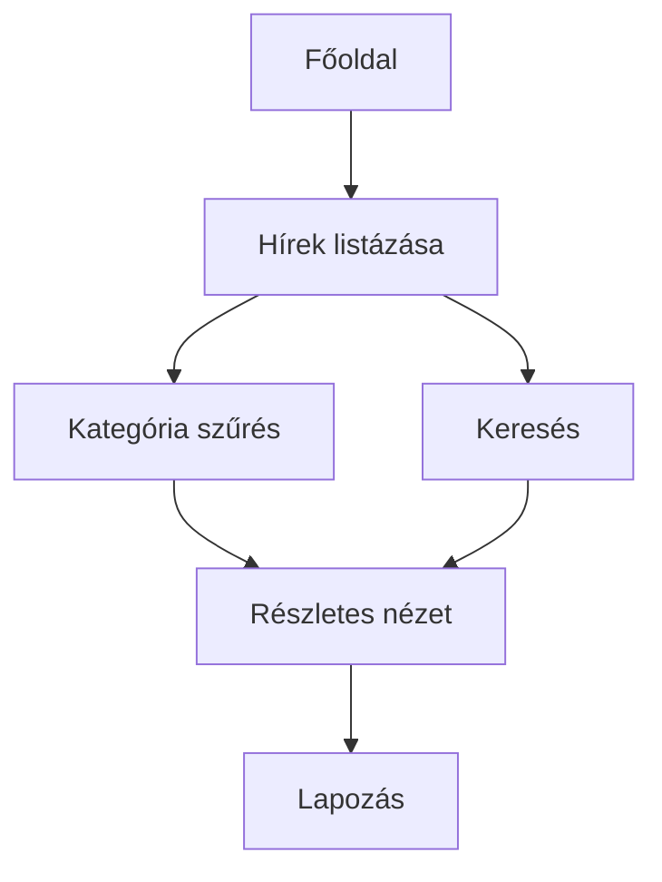
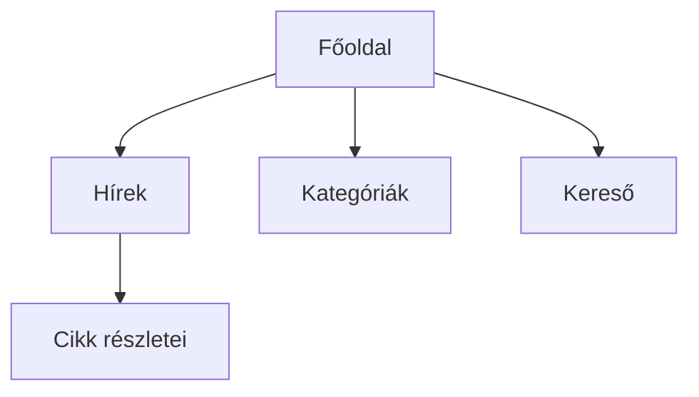

# Rendszerterv – Egyszerű Hírportál

## 1. A rendszer célja

A rendszer célja egy egyszerű webes hírportál létrehozása, amely a hírek közzétételére és átlátható böngészésére szolgál.  
A felhasználók gyorsan és egyszerűen érhetik el a legfrissebb híreket, kategória és kulcsszó alapján kereshetnek.

## 2. Projekt terv

### 2.1 Projekt szerepkörök és felelősségek

- **Megrendelő** – elvárások meghatározása, rendszer elfogadása  
- **Projektvezető** – koordináció, dokumentáció  
- **Frontend fejlesztő** – HTML, CSS, JavaScript  
- **Tesztelő** – funkcionális tesztek  

### 2.2 Fejlesztő eszközök

VS Code, Git, Chrome/Firefox fejlesztői eszközök

## 3. Üzleti folyamatok modellje

### 3.1 Üzleti szereplők

- **Felhasználó** – híroldal látogatója  
- **Rendszer** – hírek megjelenítése, keresés és szűrés  

### 3.2 Üzleti folyamatok


### 3.3 Üzleti entitások

- **Hír:** cím, kivonat, szöveg, dátum, kategória  
- **Kategória:** azonosító, név  

## 4. Követelmények

### 4.1 Funkcionális követelmények

- Hírek listázása időrendben  
- Kategóriák szerinti szűrés  
- Kulcsszavas keresés címben és szövegben  
- Részletes cikk nézet  
- Lapozás nagy elemszám esetén  
- Hibakezelés: „Nincs találat” és 404 oldal  

### 4.2 Nem funkcionális követelmények

- Egyszerű, letisztult felület  
- Gyors betöltés és stabil működés  
- Könnyen karbantartható kód  

## 5. Funkcionális terv

### 5.1 Rendszer szereplők

- Felhasználó  
- Rendszer  

### 5.2 Használati esetek

```mermaid
usecaseDiagram
actor Felhasználó
Felhasználó --> (Hírek listázása)
Felhasználó --> (Keresés)
Felhasználó --> (Kategória választás)
Felhasználó --> (Részletes nézet)
Felhasználó --> (Lapozás)
```

### 5.3 Határ osztályok

- `index.html` – főoldali lista  
- `article.html` – részletes nézet  

### 5.4 Menü hierarchia



## 6. Fizikai környezet


## 7. Absztrakt domain modell

 

## 8. Architekturális terv


## 9. Adatbázis terv


## 10. Implementációs terv


## 11. Telepítési terv


## 12. Karbantartási terv

