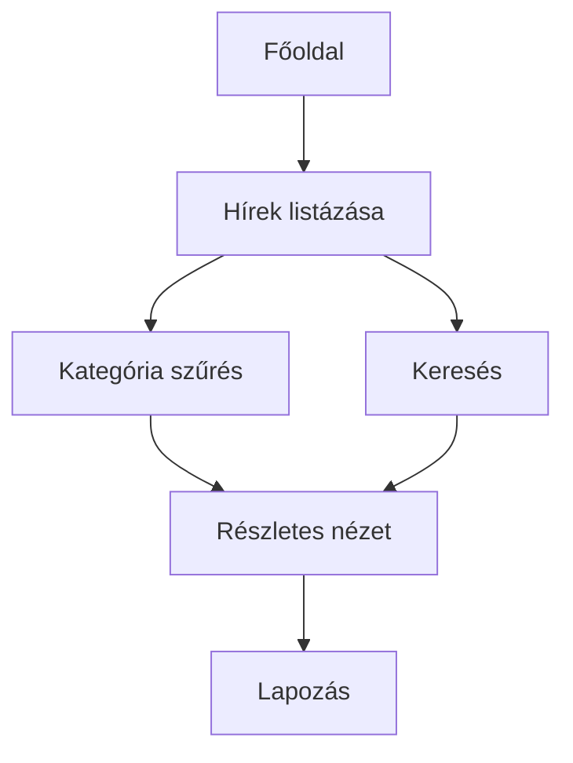

# Rendszerterv – Egyszerű Hírportál

## 1. A rendszer célja

A rendszer célja egy egyszerű webes hírportál létrehozása, amely a hírek közzétételére és átlátható böngészésére szolgál.  
A felhasználók gyorsan és egyszerűen érhetik el a legfrissebb híreket, kategória és kulcsszó alapján kereshetnek.

## 2. Projekt terv

### 2.1 Projekt szerepkörök és felelősségek

- **Megrendelő** – elvárások meghatározása, rendszer elfogadása  
- **Projektvezető** – koordináció, dokumentáció  
- **Frontend fejlesztő** – HTML, CSS, JavaScript  
- **Tesztelő** – funkcionális tesztek  

### 2.2 Fejlesztő eszközök

VS Code, Git, Chrome/Firefox fejlesztői eszközök

## 3. Üzleti folyamatok modellje

### 3.1 Üzleti szereplők

- **Felhasználó** – híroldal látogatója  
- **Rendszer** – hírek megjelenítése, keresés és szűrés  

### 3.2 Üzleti folyamatok

## 4. Követelmények

## 5. Funkcionális terv

## 6. Fizikai környezet

## 7. Absztrakt domain modell

 

## 8. Architekturális terv

## 9. Adatbázis terv

## 10. Implementációs terv

## 11. Telepítési terv

## 12. Karbantartási terv

