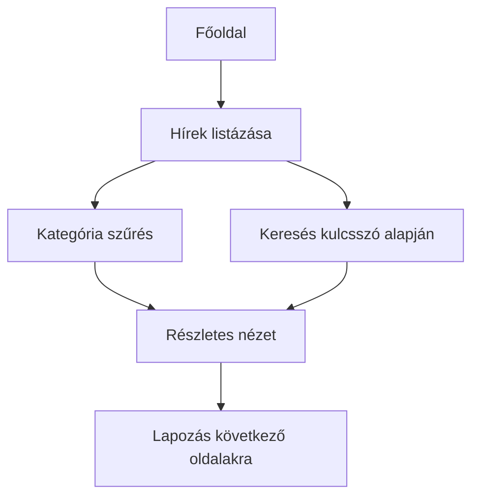
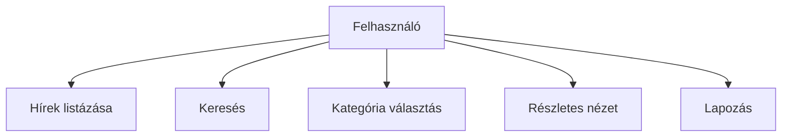
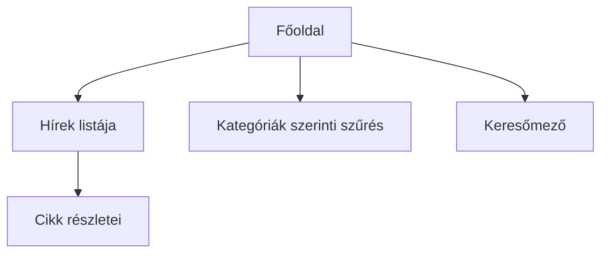
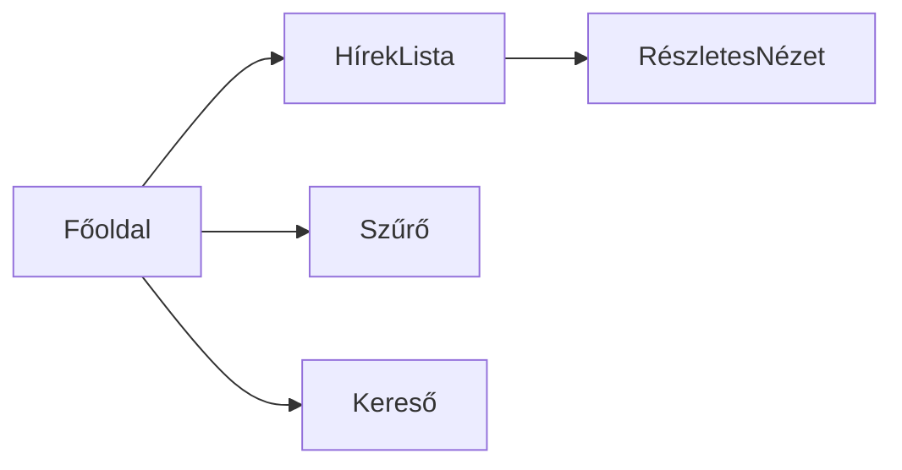
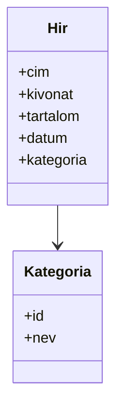

# Rendszerterv – Egyszerű Hírportál

## 1. A rendszer célja

A rendszer célja egy egyszerű webes hírportál létrehozása, amely lehetővé teszi a felhasználók számára a legfrissebb hírek gyors és átlátható elérését. A portál célja, hogy a hírek könnyen kategorizálhatók és kereshetők legyenek, így a látogatók kényelmesen böngészhetnek különböző témákban.

A portál nem foglal magában komplex interaktív funkciókat, mint például felhasználói fiókok létrehozása vagy hozzászólások írása. Ezzel tisztázzuk a projekt hatókörét: a cél a tartalom megjelenítése és egyszerű kezelhetősége.

**Alcélok:**

- Gyors betöltési idő biztosítása minden eszközön.
- Mobilbarát megjelenés a felhasználói élmény növelése érdekében.
- Egyszerű és könnyen karbantartható kódstruktúra kialakítása.

## 2. Projekt terv

### 2.1 Projekt szerepkörök és felelősségek

- **Megrendelő**: meghatározza az elvárásokat, jóváhagyja a projekt mérföldköveit, ellenőrzi az átadott verziókat.  
- **Projektvezető**: felel a projekt ütemezéséért, koordinálja a csapatot, dokumentálja a folyamatokat és a döntéseket.  
- **Frontend fejlesztő**: HTML, CSS és JavaScript fejlesztés, a felhasználói felület megvalósítása.  
- **Tesztelő**: a funkciók működésének ellenőrzése, hibák rögzítése, javaslat a fejlesztői javításokra.  

### 2.2 Fejlesztő eszközök

- VS Code, mint fő fejlesztői környezet.  
- Git verziókezelés a kód nyomon követéséhez.  
- Böngésző fejlesztői eszközök (Chrome/Firefox), hibakereséshez és teljesítmény elemzéshez.  

### 2.3 Ütemterv és mérföldkövek

- **Kezdő fázis**: követelmények rögzítése, tervezési alapok meghatározása.  
- **Fejlesztési fázis**: HTML alapok, CSS stílus és elrendezés, JavaScript funkciók.  
- **Tesztelési fázis**: integrációs és funkcionális tesztek, hibajavítások.  
- **Átadás**: MVP verzió bemutatása, visszajelzések gyűjtése, végső finomhangolás.

## 3. Üzleti folyamatok modellje

### 3.1 Üzleti szereplők

- **Felhasználó**: látogatja az oldalt, böngészi a híreket, szűr, keres és olvas.  
- **Rendszer**: felelős a hírek megjelenítéséért, kategorizálásáért, keresés és lapozás biztosításáért.  

### 3.2 Üzleti folyamatok

A felhasználó a főoldalon elindulva a híreket kategória vagy kulcsszó alapján szűrheti. A részletes cikk megtekintése után visszatérhet a listaoldalra, vagy lapozhat a következő hírekhez.

**Folyamat lépései:**

1. Főoldal megnyitása.  
2. Hírek listázása, alapértelmezett időrend szerint.  
3. Kategória szerinti szűrés alkalmazása.  
4. Kulcsszó alapján történő keresés.  
5. Részletes cikk megtekintése.  
6. Lapozás a következő oldalakra, ha nagyobb számú hír van.  

### 3.3 Üzleti entitások

- **Hír**: tartalmazza a címet, kivonatot, teljes szöveget, dátumot és kategóriát.  
- **Kategória**: azonosító és név alapján csoportosítja a híreket.  

#### Ábra: Üzleti folyamat diagram

## 4. Követelmények

### 4.1 Funkcionális követelmények

- Hírek listázása időrendben a főoldalon.  
- Kategóriák szerinti szűrés lehetősége.  
- Kulcsszavas keresés címben és szövegben.  
- Részletes cikk megtekintése, teljes szöveggel és metaadatokkal.  
- Lapozás nagy elemszám esetén.  
- Hibakezelés: „Nincs találat” és 404 oldal megjelenítése.

### 4.2 Nem funkcionális követelmények

- Egyszerű, letisztult felhasználói felület, könnyen áttekinthető navigációval.  
- Gyors betöltési idő és stabil működés minden modern böngészőben.  
- Könnyen karbantartható, moduláris kódstruktúra.  
- Alapvető böngésző kompatibilitás biztosítása, különböző képernyőméreteken is.

## 5. Funkcionális terv

### 5.1 Rendszer szereplők

- **Felhasználó:** böngészi a híreket, keres és szűr.  
- **Rendszer:** biztosítja a hírek elérhetőségét, keresés és szűrés funkciókat.

### 5.2 Használati esetek

## 5.3 Határ osztályok

- **index.html**: főoldali hírek listája, kategória szűrő és keresőmező.  
- **article.html**: részletes cikk megtekintés, metaadatokkal együtt.

## 5.4 Menü hierarchia

## 5.5 Képernyőtervek

- **Főoldal:** hírek listája, kategória szűrő, keresőmező, lapozás.  
- **Részletes nézet:** cím, teljes szöveg, dátum, kategória, vissza gomb.  

## 6. Fizikai környezet

A rendszer fizikai környezete három fő rétegre épül, amelyek egymással összhangban működnek, de külön-külön is fejleszthetők és karbantarthatók.

### HTML réteg
- Feladata a tartalom strukturált megjelenítése.
- Főoldali hírek listája, részletes cikkek, kategóriák és keresőmező biztosítása.
- Fontos a szabványos és valid HTML használata, hogy minden böngészőben egységesen jelenjen meg a felület.

### CSS réteg
- Kezeli a vizuális megjelenést: színek, betűtípusok, gombok, elrendezés.
- Támogatja a moduláris stílusokat, amelyek könnyen bővíthetők.
- Reszponzív design: mobil, tablet és asztali eszközök támogatása.
- Általános stílusok: gombok, linkek, fejléc és lábléc egységes megjelenése.

### JavaScript réteg
- Felelős a keresés, szűrés és lapozás logikájáért.
- Moduláris felépítés: minden funkció önálló modulban, könnyen karbantartható.
- Kommunikál a HTML réteggel a DOM manipuláció révén és a CSS-sel a dinamikus megjelenítéshez.

## 7. Absztrakt domain modell

## 7.1 Domain specifikáció

A rendszer domain modellje az alábbi fő entitásokra épül, amelyek meghatározzák a hírek kezelésének és megjelenítésének logikáját.

- **Hírek**
  - Minden hír tartalmaz:
    - **Cím**: a hír rövid, informatív címe.
    - **Kivonat**: rövid összefoglaló a cikk tartalmáról.
    - **Teljes szöveg**: a cikk teljes tartalma HTML formátumban.
    - **Dátum**: a hír publikálásának időpontja.
    - **Kategória**: a hírhez tartozó kategória, amely csoportosítja a tartalmat.

- **Kategóriák**
  - Azonosítóval és névvel ellátott csoportok.
  - Segítik a hírek rendezését, szűrését és gyors elérését.

- **Metaadatok**
  - Szerző: a hír írója.
  - Forrás: az eredeti hírforrás.
  - Hivatkozások: kapcsolódó cikkek vagy külső linkek.

## 8. Architekturális terv

## 8.1 Tervezési minta

A rendszer rétegzett architektúrát követ, amely lehetővé teszi az egyes komponensek elkülönített fejlesztését, tesztelését és karbantartását.

### Rétegek

- **UI réteg (HTML + CSS)**
  - Felhasználói felület megjelenítése.
  - Struktúrált tartalom: főoldali lista, részletes cikkek, kategória szűrő, keresőmező.
  - Reszponzív megjelenés biztosítása mobil, tablet és asztali eszközökön.

- **Logikai réteg (JavaScript)**
  - Felhasználói interakciók kezelése: szűrés, keresés, lapozás.
  - Moduláris felépítés: Hírkezelő, Szűrő, Kereső és Megjelenítő modulok.

- **Adat réteg (JS objektumok / későbbi SQL adatbázis)**
  - MVP-ben: hírek és kategóriák JavaScript objektumokban.
  - Bővített verzióban: normalizált SQL adatbázis a nagyobb adatmennyiség hatékony kezelése érdekében.

## 8.2 Biztonsági funkciók

A rendszer tervezésénél különös figyelmet fordítottunk az alapvető biztonsági intézkedésekre, mivel a cél egy olvasható és egyszerű hírportál.

- **Csak olvasható tartalom**
  - A felhasználók nem tudnak adatot módosítani, így nincs lehetőség véletlen vagy szándékos adatvesztésre.
  - Az oldalon nem találhatók szerkesztői felületek vagy adminisztrációs modulok.

- **Nincs felhasználói adatbevitel**
  - Nincsenek űrlapok, regisztráció vagy bejelentkezési lehetőségek, így minimalizált a potenciális támadási felület.

- **Minimalizált támadási felület**
  - A rendszer kliensoldali adatkezelést alkalmaz, nincs szerveroldali feldolgozás.
  - XSS, SQL injection és egyéb tipikus webes támadások lehetősége minimális.

---

## 9. Adatbázis terv

A rendszer tervezésénél különös figyelmet fordítottunk az alapvető biztonsági intézkedésekre, mivel a cél egy olvasható és egyszerű hírportál.

- **Csak olvasható tartalom**
  - A felhasználók nem tudnak adatot módosítani, így nincs lehetőség véletlen vagy szándékos adatvesztésre.
  - Az oldalon nem találhatók szerkesztői felületek vagy adminisztrációs modulok.

- **Nincs felhasználói adatbevitel**
  - Nincsenek űrlapok, regisztráció vagy bejelentkezési lehetőségek, így minimalizált a potenciális támadási felület.

- **Minimalizált támadási felület**
  - A rendszer kliensoldali adatkezelést alkalmaz, nincs szerveroldali feldolgozás.
  - XSS, SQL injection és egyéb tipikus webes támadások lehetősége minimális.

---

## 10. Implementációs terv

## 11. Telepítési terv

## 12. Karbantartási terv

